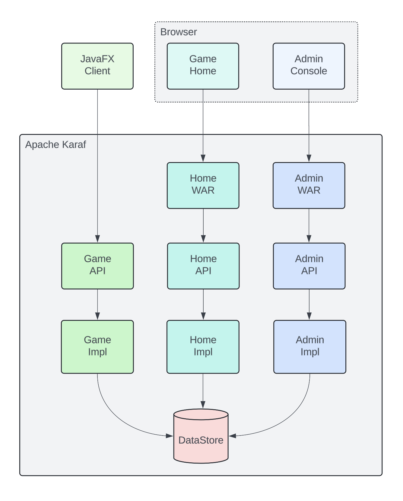
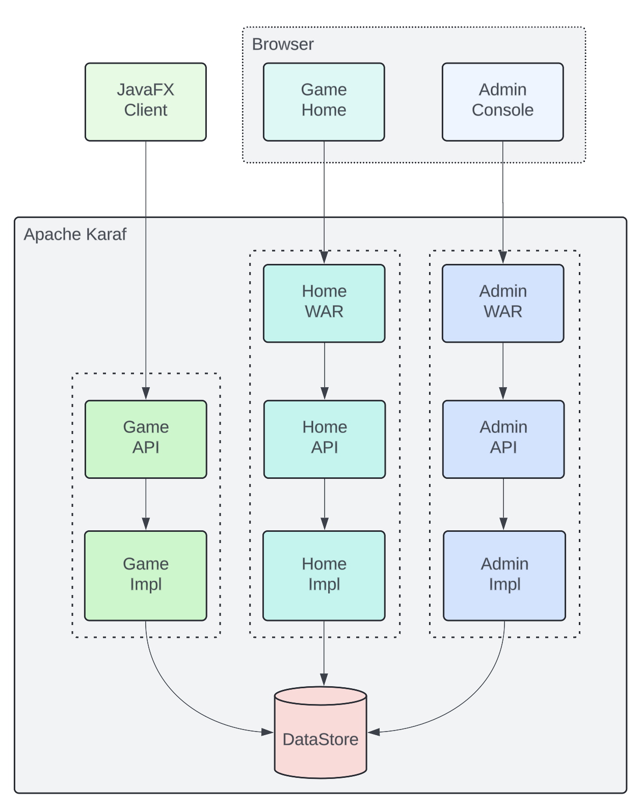
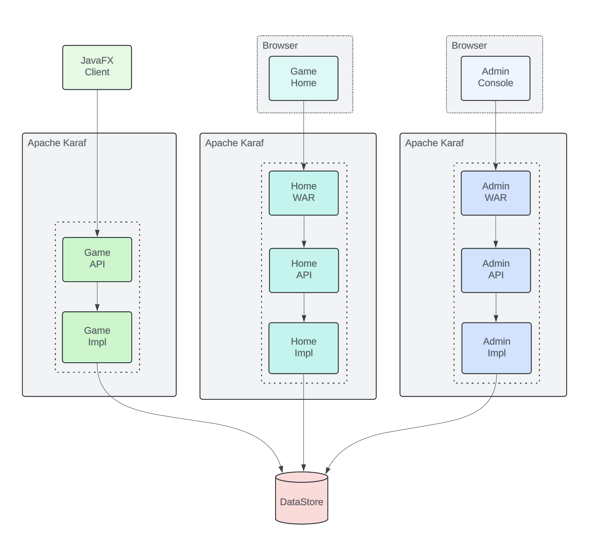
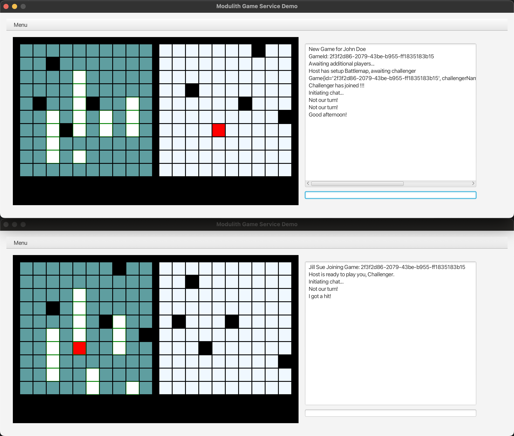

== Modulith Demo

The purpose of this demo is to illustrate the modular monolith (modulith) architectural style, and the Apache frameworks/libraries/runtimes that help build them. To help make this demo concrete, we implement a Client-Server for a board game, using a modular monolith as the backend server architecture.

=== Why a modular monolith?

Modular monoliths allow the operator to keep things simple in terms of deployment (compared to managing multiple microservices), and changes/updates can by deployed more efficiently as only specific modules/components need to be updated.

== The Game, Architecture & Technology Stack

=== The Game

Our demo takes the form of a board game with the ability to play other players via a game server.

When the game client creates a new game, it registers itself with the backend server.

Another game client can then join an awaiting game.

Once both players have placed their tiles, the game begins allowing turns to be taken. As players successfully bombard their opponent tiles will change from grey to red to indicate hits.

While playing the game, players can also utilize a chat feature. The chat messages are between the host and challenger.

=== Architecture & Technology Stack

The Client is implemented using JavaFX, and utilizes the Game server's REST endpoints via Apache CXF WebClient.

Our Server is designed as a set of Backend-For-Frontend applications.

 * Game - The core Game Server, and its RESTful endpoints.

 * Home - A homepage for the game, and backend services for dynamic content.

 * Admin - An admin page to provide statics.

 * Datastore - A common data source used by each BFF stack.

The Server side is implemented as a collection of OSGi modules. The modules take the form of API and IMPL bundles. The Datastore bundle implements a container available service offering of its API. In this fashion each BFF may avail of the common datasource.

The Server side also contains a pair of Web bundles, these manage WAR file & their infrastructure.

==== Scaling out

As our application has been built to be split up along domains, we can trivially break our modulith into smaller systems to achieve runtime goals - perhaps we only need 1 or 2 JVMs supplying Home and Admin webpages, but many game servers. Alternatively, the whole system could be redeployed on larger hardware. This does not preclude using Dockers/K8s to orchestrate along microservices principles - we have some additional flexibility.

=== Apache Karaf: Modulith Runtime

Karaf is the modulith runtime, supporting a wide range of frameworks and technologies.

[,xml,num]
----
<feature name="modulith-demo" version='${project.version}'>
    <feature version="${project.version}">_modulith-application-deps</feature>
    <conditional>
        <condition>_modulith-application-deps</condition>
        <feature version="${project.version}">modulith-admin</feature>
        <feature version="${project.version}">modulith-home</feature>
        <feature version="${project.version}">modulith-game</feature>
    </conditional>
</feature>
----

We use Apache Karaf's OSGi support for deployment, and runtime wiring. We also make use of Apache Karaf feature descriptor file to help simplify installing our demo.

=== Apache CXF: JAX-RS

Apache CXF is an open source software project developing a Web services framework.

[,java,num]
----
private ActiveGames getActiveGames() {
    try {
        WebClient webClient = WebClient.create(host + "/cxf/game/getActiveGames")
                .accept(MediaType.APPLICATION_JSON);
        Response respGet = webClient.get();
        return respGet.readEntity(ActiveGames.class);
    } catch (Exception ex) {
        throw new RuntimeException(ex);
    }
}
----

We use Apache CXF's WebClient to use our Game server's RESTful endpoints.

=== JavaFX

JavaFX is a software platform for creating and delivering desktop applications, as well as rich web applications that can run across a wide variety of devices.

We use JavaFX for our client GUI.

== Build and run the demo.

The client and server projects are both Maven based, as such one need only source JAVA_HOME, and MAVEN_HOME, and make both available on their PATH.

Please review the ReadMe file in the client and server folders.

== Conclusions

The modulith architectural style provides development teams with simplified deployment model, and baked in flexibility for scaling, modification, and feature evolution. Apache Karaf excels at providing a modulith runtime environment to support these kinds of projects.

== About the Authors

link:https://github.com/savoirtech/blogs/blob/main/authors/JamieGoodyear.md[Jamie Goodyear]

== Reaching Out

Please do not hesitate to reach out with questions and comments, here on the Blog, or through the Savoir Technologies website at https://www.savoirtech.com.

== With Thanks

Thank you to the Apache Karaf, and CXF communities.

(c) 2024 Savoir Technologies
