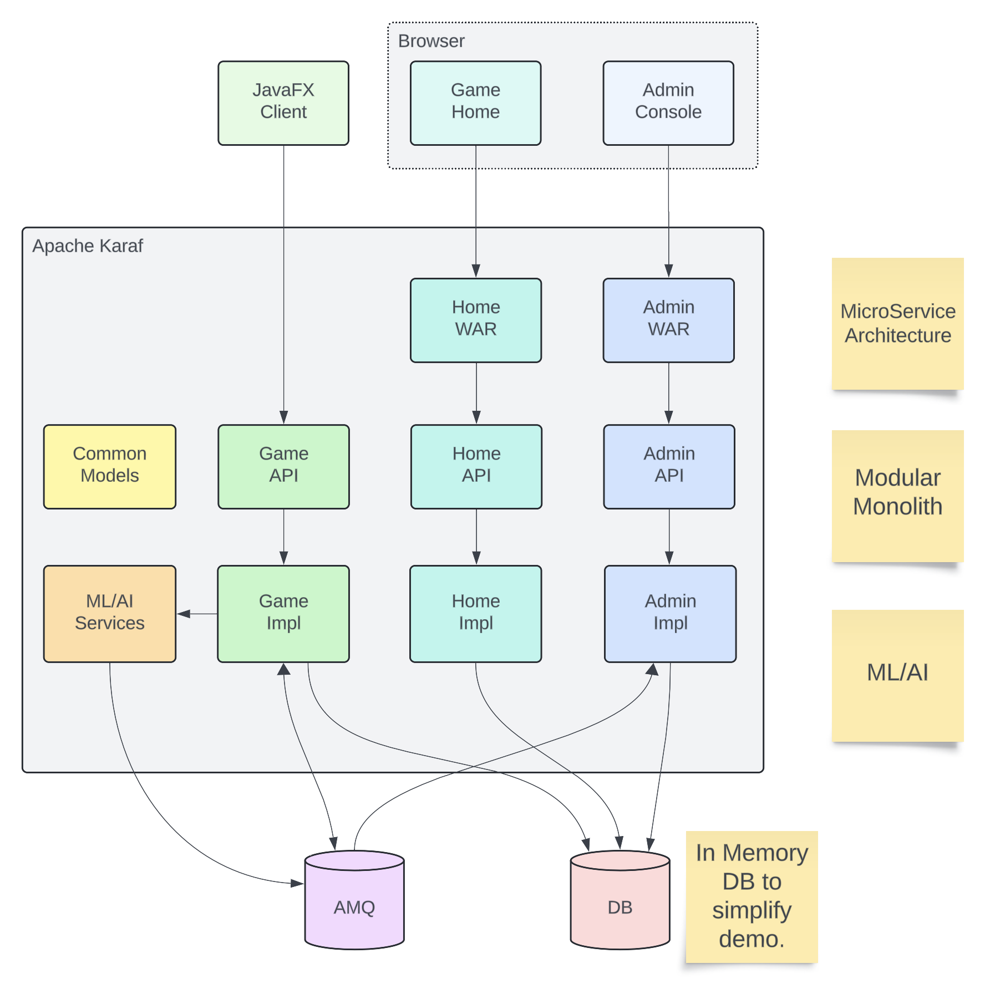

== Modulith Demo

== Architecture & Technology Stack

The purpose of this demo is to illustrate various architectural designs, and the Apache frameworks/libraries/runtimes that help build them.

=== Modulith: A Modular Monolith

=== Apache Karaf: Modulith Runtime

=== Apache CXF: JAX-RS

==== Deep Java Learning

==== LangChain4j

=== Apache Camel: Enterprise Integration Patterns

=== Apache ActiveMQ: JMS Broker, Event Bus.

=== JavaFX

== Build and run the demo.

=== Test APIs

Verify Admin Service:
[,bash,num]
----
curl -X GET -H "Content-type: application/json" -H "Accept: application/json" "http://127.0.0.1:8181/cxf/admin/status"
----

Verify Game Service:
[,bash,num]
----
 curl -X GET -H "Content-type: application/json" -H "Accept: application/json" "http://127.0.0.1:8181/cxf/game/newGame"

----

== Conclusions

== About the Authors

link:https://github.com/savoirtech/blogs/blob/main/authors/JamieGoodyear.md[Jamie Goodyear]

== Reaching Out

Please do not hesitate to reach out with questions and comments, here on the Blog, or through the Savoir Technologies website at https://www.savoirtech.com.

== With Thanks

Thank you to the Apache Karaf, CXF, ActiveMQ, and Camel communities.

(c) 2024 Savoir Technologies
